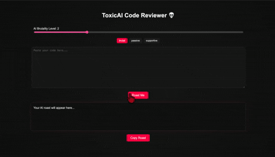

# 💀 ToxicAI Code Reviewer

An AI-powered code reviewer that delivers brutally honest, emotionally damaging, and completely unnecessary feedback.

Built for the DEV April Fools Challenge.

---

## 🎥 Demo

---

## What It Does

Paste your code → get instantly judged by an AI that behaves like a senior developer who has lost patience with humanity.

ToxicAI analyses your code and responds with:
- a brutal roast
- fake developer metrics
- a dramatic final verdict

Designed to be entertaining, not useful.

---

## Features

- AI Code Roasting (Gemini-powered)
- Brutality Intensity Slider (Soft → Emotional Damage)
- Personality Modes:
  - Brutal
  - Passive-Aggressive
  - Overly Supportive (somehow worse)
- Fake Developer Metrics:
  - Vibe Score
  - Ego Risk Level
  - Stack Overflow Dependency
- Dramatic loading state (“AI is judging your life choices…”)
- One-click Copy Roast
- Structured Output:
  - Roast
  - Metrics
  - Verdict Line

---

## How It Works

1. User submits a code snippet
2. Input is sent to Gemini 2.5 Flash API
3. A structured prompt defines tone, personality, and output format
4. AI generates:
   - roast
   - fake metrics
   - final verdict
5. Response is parsed and displayed in a styled UI

---

## Tech Stack

- React (Vite)
- TypeScript
- Gemini 2.5 Flash API (Google AI)
- Prompt engineering for structured emotional outputs

---

## Why This Exists

This project solves absolutely nothing.

It exists purely to:
- demonstrate AI integration
- emotionally evaluate developers for entertainment purposes only

This project explores prompt engineering, structured AI outputs, and personality-driven LLM design.

---

## ⚠️ Disclaimer

This tool is:
- not accurate
- not helpful
- emotionally questionable
- definitely not production-grade

Use at your own emotional risk.

---

## 🔥 Submission Category

**Best Google AI Usage**

Leveraging Gemini to generate:
- personality-driven code roasts
- structured fake metrics
- dynamic developer “evaluation”
- comedic AI reasoning output

---

## 🚀 Future Improvements

- More personality modes (e.g. “Tech Lead Burnout”, “Intern Supervisor Mode”)
- Custom prompt builder for user-defined roasting style
- Export/share roast images
- Support for GitHub repo roasting
- Improved structured output parsing

---

## Final Note

If your code gets insulted, that is a feature — not a bug.